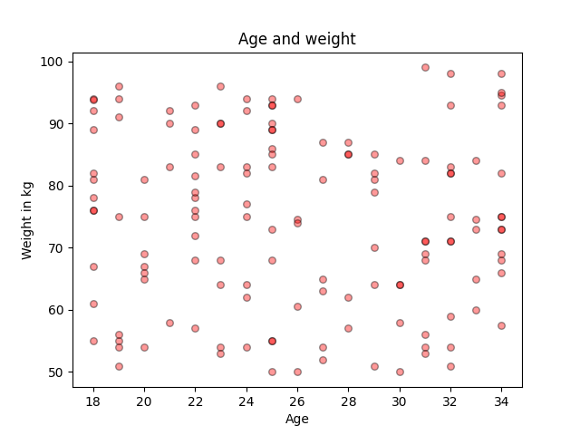
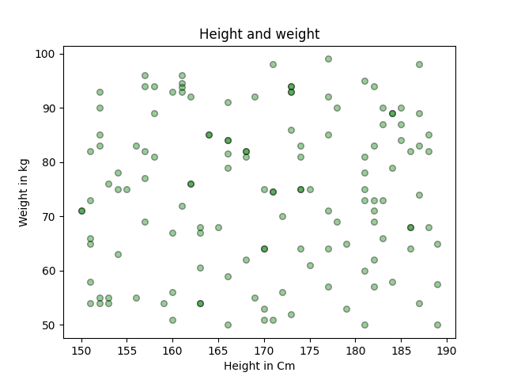
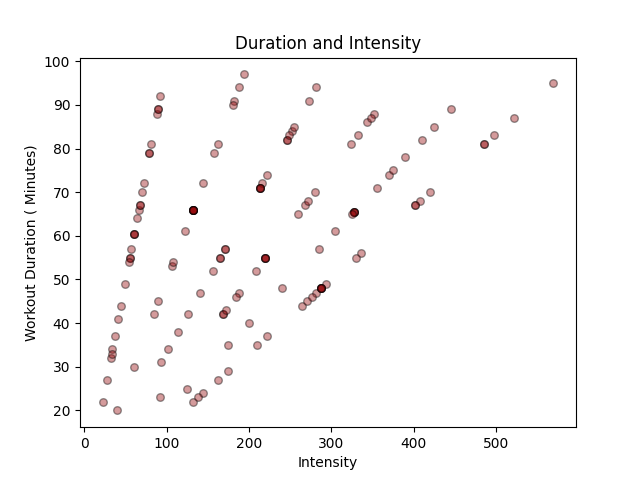
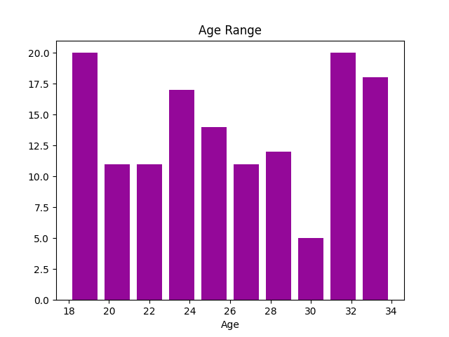
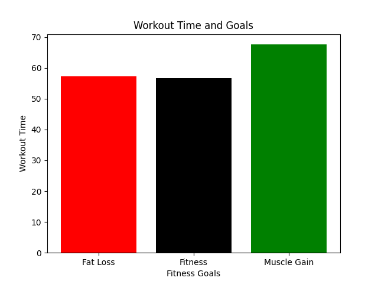
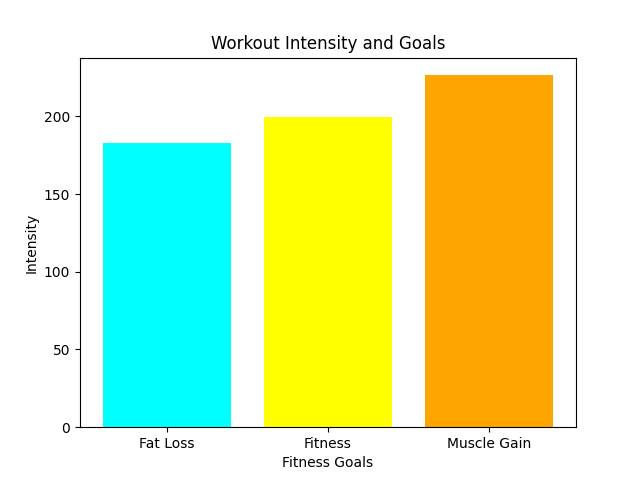

# 📊 Fitness Data Analyzer

## 📌 Project Overview

The **Fitness Data Analyzer** is an end-to-end data analysis project built using Python. This project focuses on cleaning, processing, engineering features, and visualizing fitness-related data from gym members.

The primary objective of this project is to demonstrate practical experience working with real-world data workflows, including data cleaning, feature engineering, and visualization using industry-standard Python libraries.

This project highlights my ability to work with:

- **Pandas** for structured data cleaning and manipulation  
- **NumPy** for feature engineering and conditional transformations  
- **Matplotlib** for analytical data visualization  
- **Modular Python design** using functions and multi-file architecture for maintainability and scalability  

---

## 🛠 Technologies Used

- Python
- Pandas
- NumPy
- Matplotlib
- Git & GitHub

---

## 📁 Project Structure

```
fitness-data-analyzer/
│
├── data/
│   └── gym_members_150_rows.csv
│
├── src/
│   ├── data_cleaning.py
│   ├── feature_engineering.py
│   ├── visualization.py
│   └── gym_analyzer_main.py
│
├── images/
│   └── Generated visualizations
│
├── requirements.txt
├── .gitignore
└── README.md
```

---

## 📊 Dataset Description

The dataset contains gym member information including:

- Age  
- Height  
- Weight  
- Workout frequency  
- Workout duration  
- Fitness goals  

The dataset intentionally includes missing values, allowing demonstration of real-world data cleaning and preprocessing techniques.

---

## 🧹 Data Cleaning

Data cleaning was performed using **Pandas**, following a structured and layered approach to ensure data reliability and accuracy.

### Cleaning Steps Implemented

### 1. Handling Missing Workout Duration
- Missing values were filled using median workout duration grouped by workout frequency.

### 2. Handling Missing Weight
Missing weight values were estimated using a multi-step strategy:

- Median weight grouped by height and fitness goal  
- Median weight grouped by height  
- Overall dataset median weight as a fallback solution  

### 3. Handling Missing Height
- Rows with missing height values were removed due to the low number of missing entries and the difficulty of estimating height accurately.

---

## ⚙️ Feature Engineering

Additional analytical features were created using **NumPy** and **Pandas** to enhance dataset insights.

### Features Created

### 📏 BMI Calculation
```
BMI = weight / height²
```

### 🧍 BMI Category Classification
Members are categorized into:

- Underweight  
- Normal  
- Overweight  
- Obese  

### 🏃 Activity Level Classification
Based on weekly workout frequency:

- Low Activity  
- Moderate Activity  
- High Activity  
- No Training  

### 🔥 Workout Intensity Metric
A new metric representing overall training load:

```
Intensity = workout_days_per_week × avg_workout_minutes
```

---

## 📈 Data Visualization

Matplotlib was used to create visualizations that explore relationships, distributions, and comparative insights within the dataset.

---

### 📊 Relationship Visualizations

#### Age vs Weight


#### Height vs Weight


#### Workout Duration vs Intensity


---

### 📊 Distribution Visualization

#### Age Distribution


---

### 📊 Comparative Visualizations

#### Average Workout Duration per Fitness Goal


#### Average Workout Intensity per Fitness Goal


---

## 🔍 Key Insights

- Members focused on muscle gain tend to demonstrate higher workout intensity levels.
- Workout duration shows a positive relationship with overall workout intensity.
- Height and weight show a strong positive correlation across members.
- The dataset contains a balanced age distribution, improving analysis reliability.

---

## 🧠 Skills Demonstrated

This project demonstrates my ability to:

- Perform structured data cleaning using Pandas  
- Engineer meaningful analytical features using NumPy  
- Create data visualizations using Matplotlib  
- Design modular Python applications using reusable functions  
- Organize code into multiple files for scalability and maintainability  
- Build a full data analysis pipeline from raw dataset to analytical insights  

---

## 🏗 Code Architecture

The project follows a modular and maintainable design pattern:

- `data_cleaning.py` → Handles missing data and preprocessing  
- `feature_engineering.py` → Creates derived metrics and categorical features  
- `visualization.py` → Generates analytical visualizations  
- `gym_analyzer_main.py` → Executes the full analysis pipeline  

The project also uses:

```
if __name__ == "__main__":
```

to ensure controlled execution and improve code reusability.

---

## ▶️ How To Run The Project

### 1. Clone the Repository
```
git clone https://github.com/Ryzx_56/fitness-data-analyzer.git

```

### 2. Install Dependencies
```
pip install -r requirements.txt
```

### 3. Run the Main Script
```
python gym_analyzer_main.py
```

---

## 📦 Dependencies

- pandas
- numpy
- matplotlib

---

## 🎯 Project Purpose

This project was developed to strengthen and demonstrate practical skills in:

- Real-world data analysis workflows  
- Python-based data processing  
- Data visualization and storytelling  
- Writing clean, modular, and maintainable analytical code  

---

## 🧩 Challenges & Learning Outcomes

- Applied grouped median strategies to handle missing data effectively  
- Improved understanding of modular Python project architecture  
- Strengthened ability to select appropriate visualization techniques for different data relationships  
- Reinforced best practices for building reproducible data pipelines  

---

## 🚀 Future Improvements

Potential future extensions include:

- Machine learning models to predict fitness outcomes  
- Interactive dashboard development  
- Advanced statistical analysis  
- Additional feature engineering and exploratory data analysis  

---

## 👨‍💻 Author

**Abdulmalik Hawsawi**
